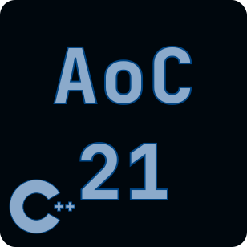

# Advent Of Code 2021 
### A compilation of 2021 advent of code solutions written in C++

:exclamation:The purpose of this project is to get acquainted with the latest additions to the C++ language, 
therefore it requires a compiler that supports all the newest features (tested with gcc-13 and clang-17)
